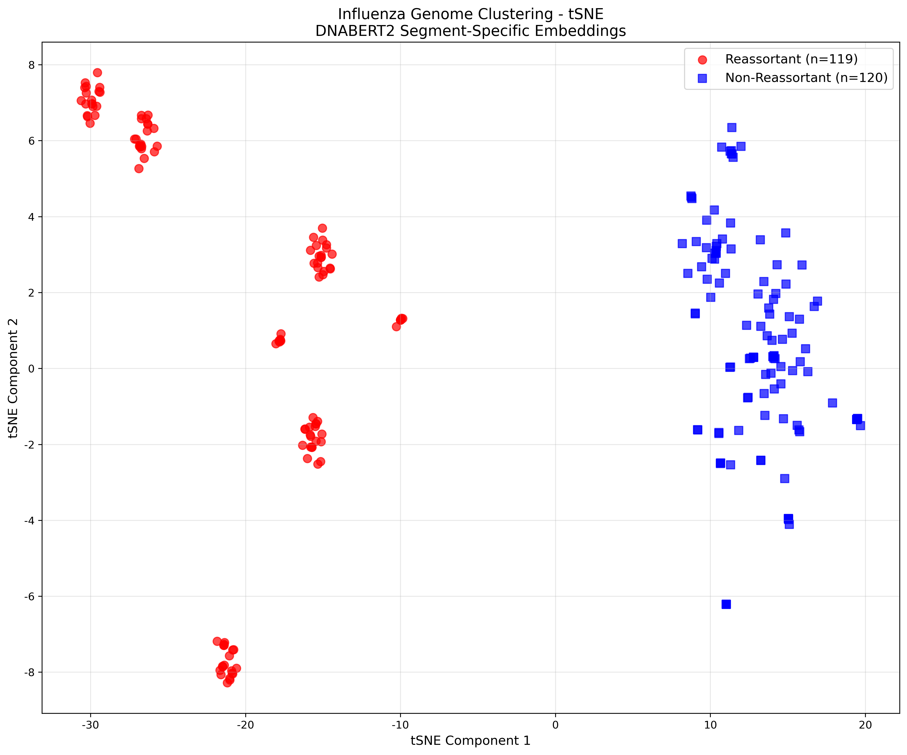

t-SNE was applied to the DNABERT2-derived embeddings to project the high-dimensional sequence representations into two dimensions. The resulting visualization showed clear separation between reassortant and non-reassortant sequences, demonstrating that DNABERT2 successfully captures reassortment-related genomic features even without task-specific fine-tuning.

