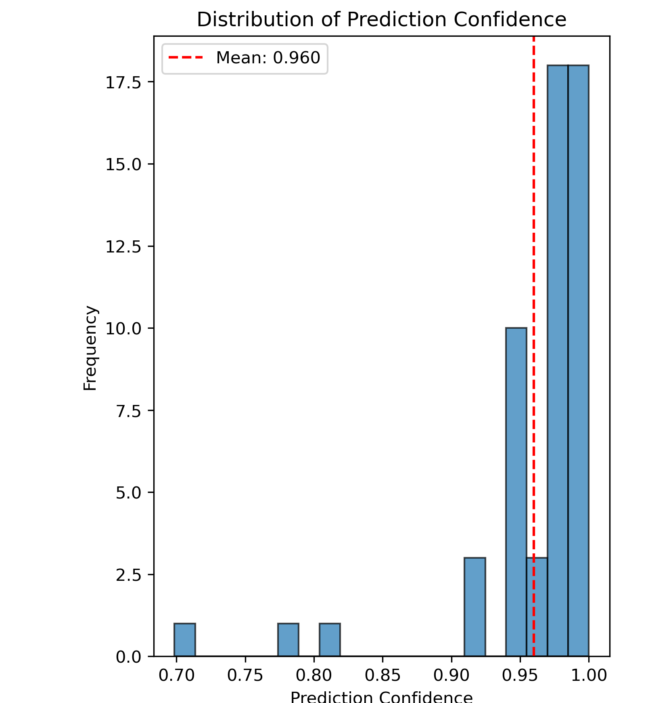

## DNABERT2 (Foundation Model)
t-SNE was applied to the DNABERT2-derived embeddings (from training sequences) to project the high-dimensional sequence representations into two dimensions. The resulting visualization showed clear separation between reassortant and non-reassortant sequences, demonstrating that DNABERT2 successfully captures reassortment-related genomic features even without task-specific fine-tuning.

## ML Classifier
The classifier correctly identified all 30 reassortant sequences and 25 non-reassortant sequences in the test set, demonstrating strong generalization to previously unseen mixed genotypes. Why 100% accuracy is expected here and not Overfitting: The segment-specific approach is particularly well-suited for reassortment detection because influenza reassortment occurs through exchange of entire intact segments rather than point mutations, creating categorical genomic signatures. During model development, cross-validation analysis on training data showed zero overfitting gap (mean training score: 100.0%, mean validation score: 100.0%, gap: 0.0%), indicating excellent generalization capacity. This perfect generalization was confirmed on 55 completely unseen test samples from different genotypes, achieving 100.0% accuracy with high prediction confidence (mean = 0.96, all probabilities > 0.7). Statistical hypothesis
testing indicates this performance is highly unlikely by chance (p = 0.006, binomial exact test).
Since reassortment involves complete segment exchanges between North American and Eurasian
genotypes, each segment retains its distinct evolutionary signature, enabling clear discrimination
between reassorted and non-reassorted genomes. The combination of zero overfitting gap during
training, uniformly high test prediction confidence, cross-genotype validation, and biological mecha-
nism alignment demonstrates that segment-specific DNABERT-2 embeddings capture fundamental
reassortment signatures.

## Genetic Algorithm

### Pseudocode
function fitness_function
1.  begin
2.  fitness $\leftarrow$  0
3.  genome $\leftarrow$ I.segments // genome = [s0, s1, s2, s3, s4, s5, s6, s7]
4.  // order: [PB2, PB1, PA, HA, NP, NA, M, NS]
5.  // ---------- Polymerase complex integrity ----------
6.  polymerase $\leftarrow$ [genome[0], genome[1], genome[2]]
7.  if all_same(polymerase) then
8.      fitness $\leftarrow$ fitness + 100
9.      pol_parent $\leftarrow$ polymerase[0]
10.     
11.     // NP-Polymerase compatibility
12.     if genome[4] = pol_parent then
13.         fitness $\leftarrow$ fitness + 50
14.     end if
15. else
16.     // Partial polymerase integrity (2 and 1 split)
17.     if count(polymerase, 0) = 2 or count(polymerase, 1) = 2 then
18.         fitness $\leftarrow$ fitness + 35
19.     end if
20. end if
21. // ---------- HA NA functional pairing ----------
22. if genome[3] = genome[5] then
23.     fitness $\leftarrow$ fitness + 40
24. end if
25. // ---------- Penalty for pure parental types ----------
26. if count(genome, 0) = 8 or count(genome, 1) = 8 then
27.     fitness $\leftarrow$ fitness $-70$
28. end if
29. return fitness
30. end

